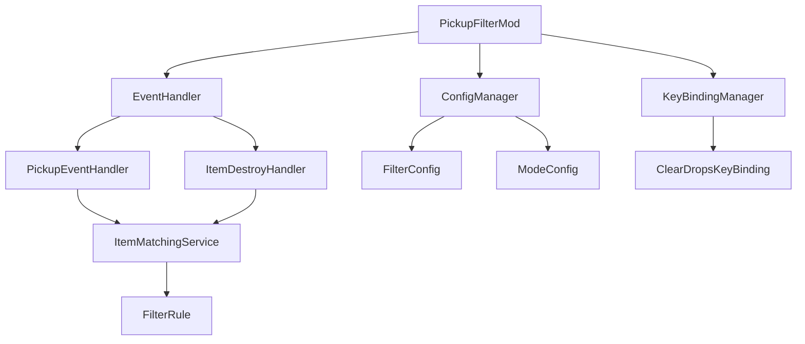

# 设计文档

## 概述

拾取筛是一个我的世界1.12.2 Forge模组，通过事件驱动的架构提供智能掉落物管理功能。该模组使用Forge的事件系统来拦截和处理掉落物相关的游戏事件，并通过客户端配置系统管理用户偏好设置。

## 架构

### 整体架构



### 模组结构

模组采用模块化设计，主要组件包括：

1. **主模组类 (PickupFilterMod)**: 负责模组初始化和组件协调
2. **配置管理器 (ConfigManager)**: 管理用户配置和过滤规则
3. **事件处理器 (EventHandler)**: 处理Forge事件和游戏逻辑
4. **按键绑定管理器 (KeyBindingManager)**: 管理快捷键功能
5. **物品匹配服务 (ItemMatchingService)**: 执行掉落物过滤逻辑

## 组件和接口

### 主模组类 (PickupFilterMod)

```java
@Mod(modid = PickupFilterMod.MODID, version = PickupFilterMod.VERSION)
public class PickupFilterMod {
    public static final String MODID = "pickupfilter";
    public static final String VERSION = "1.0.0";
    
    @Instance(MODID)
    public static PickupFilterMod instance;
    
    private ConfigManager configManager;
    private EventHandler eventHandler;
    private KeyBindingManager keyBindingManager;
    
    @EventHandler
    public void preInit(FMLPreInitializationEvent event);
    
    @EventHandler
    public void init(FMLInitializationEvent event);
    
    @EventHandler
    public void postInit(FMLPostInitializationEvent event);
}
```

### 配置管理器 (ConfigManager)

```java
public class ConfigManager {
    public enum FilterMode {
        DESTROY_MATCHING,
        PICKUP_MATCHING,
        DISABLED
    }
    
    private FilterMode currentMode;
    private Set<ItemStack> filterItems;
    private Configuration config;
    
    public void loadConfig(File configFile);
    public void saveConfig();
    public FilterMode getCurrentMode();
    public void setCurrentMode(FilterMode mode);
    public boolean isItemFiltered(ItemStack item);
    public void addFilterItem(ItemStack item);
    public void removeFilterItem(ItemStack item);
}
```

### 事件处理器 (EventHandler)

```java
public class EventHandler {
    private ConfigManager configManager;
    private ItemMatchingService matchingService;
    
    @SubscribeEvent
    public void onEntityItemPickup(EntityItemPickupEvent event);
    
    @SubscribeEvent
    public void onLivingUpdate(LivingEvent.LivingUpdateEvent event);
    
    @SubscribeEvent
    public void onKeyInput(KeyInputEvent event);
    
    private void handlePickupFiltering(EntityItemPickupEvent event);
    private void handleAutoDestroy(EntityPlayer player);
    private void clearNearbyDrops(EntityPlayer player);
}
```

### 按键绑定管理器 (KeyBindingManager)

```java
public class KeyBindingManager {
    public static KeyBinding clearDropsKey;
    
    public void registerKeyBindings();
    public boolean isClearDropsKeyPressed();
}
```

### 物品匹配服务 (ItemMatchingService)

```java
public class ItemMatchingService {
    private ConfigManager configManager;
    
    public boolean matchesFilter(ItemStack item);
    public boolean shouldPickup(ItemStack item, FilterMode mode);
    public boolean shouldDestroy(ItemStack item, FilterMode mode);
}
```

## 数据模型

### 过滤规则 (FilterRule)

```java
public class FilterRule {
    private String itemName;
    private int metadata;
    private String modId;
    private boolean useWildcard;
    
    public boolean matches(ItemStack item);
    public String serialize();
    public static FilterRule deserialize(String data);
}
```

### 配置数据结构

```java
public class FilterConfig {
    private FilterMode mode;
    private List<FilterRule> filterRules;
    private int clearRadius; // 以区块为单位
    private boolean showMessages;
    
    // getter和setter方法
}
```

## 正确性属性

*属性是一个特征或行为，应该在系统的所有有效执行中保持为真——本质上是关于系统应该做什么的正式声明。属性作为人类可读规范和机器可验证正确性保证之间的桥梁。*

### 属性 1: 模式切换一致性
*对于任何*有效的模式切换操作，系统状态应该立即反映新的模式设置，并且所有后续的掉落物处理行为应该符合新模式的规则
**验证需求: 需求 1.2**

### 属性 2: 销毁模式掉落物移除
*对于任何*在销毁匹配掉落物模式下的匹配掉落物，当该掉落物进入玩家拾取范围时，应该从世界中被移除而不触发拾取事件
**验证需求: 需求 2.2, 2.3**

### 属性 3: 拾取模式过滤一致性
*对于任何*在拾取匹配掉落物模式下的拾取尝试，只有匹配过滤条件的掉落物应该被成功拾取，不匹配的掉落物应该保持在世界中
**验证需求: 需求 3.3, 3.4**

### 属性 4: 关闭模式透明性
*对于任何*在关闭模式下的掉落物交互，系统行为应该与原版我的世界完全相同，不进行任何拦截、销毁或修改操作
**验证需求: 需求 1.3, 4.1, 4.2, 4.3**

### 属性 5: 快捷键清除完整性
*对于任何*快捷键清除操作，应该移除且仅移除玩家周围2个区块范围内的所有掉落物实体，并向玩家显示确认消息
**验证需求: 需求 5.2, 5.3, 5.4**

### 属性 6: 配置持久性往返
*对于任何*配置更改（包括过滤规则和模式设置），保存后重新加载应该产生完全相同的配置状态
**验证需求: 需求 6.2, 6.4, 8.4**

### 属性 7: 匹配逻辑一致性
*对于任何*给定的掉落物和过滤规则集合，匹配结果应该在所有使用该规则集合的上下文中保持一致
**验证需求: 需求 6.3**

## 错误处理

### 配置错误处理
- 配置文件损坏时使用默认设置
- 无效的过滤规则被忽略并记录警告
- 模式切换失败时回退到关闭模式

### 运行时错误处理
- 事件处理异常不应影响游戏正常运行
- 掉落物查询失败时跳过该次处理
- 按键绑定冲突时提供用户提示

### 兼容性错误处理
- 其他模组的掉落物实体应该被正确识别
- 自定义物品的匹配应该基于注册名称
- 版本不兼容时禁用功能并提示用户

## 测试策略

### 双重测试方法
- **单元测试**: 验证特定示例、边界情况和错误条件
- **属性测试**: 验证所有输入的通用属性
- 两者互补且都是全面覆盖所必需的

### 单元测试重点
单元测试应专注于：
- 演示正确行为的具体示例
- 组件之间的集成点
- 边界情况和错误条件

### 属性测试重点
属性测试应专注于：
- 对所有输入都成立的通用属性
- 通过随机化实现全面的输入覆盖

### 属性测试配置
- 每个属性测试最少100次迭代（由于随机化）
- 每个属性测试必须引用其设计文档属性
- 标签格式: **功能: pickup-filter, 属性 {编号}: {属性文本}**

### 测试框架
- 使用JUnit 4进行单元测试（与1.12.2兼容）
- 使用jqwik进行属性测试
- 使用Mockito进行必要的模拟（最小化使用）

### 测试环境
- 使用Forge开发环境进行集成测试
- 模拟客户端环境进行UI相关测试
- 使用测试世界进行实体交互测试